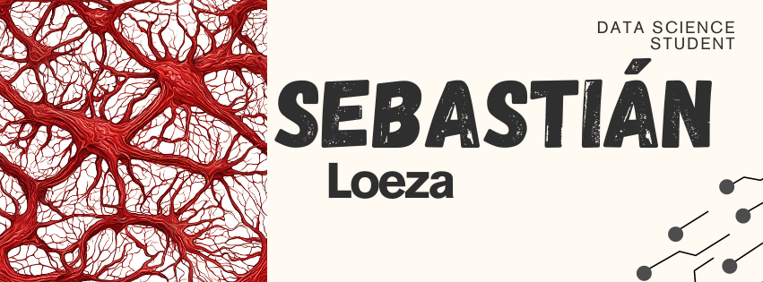

# 💫 About Me:
🔭 I’m currently studying data science at ESCOM - IPN 🌱 I’m currently learning algorithms and machine learning models 🤝 I'm keen on learning new languages such as portuguese   🐝 IBM - Blue Journey Student

# 💻 Tech Stack:
            

# 📊 GitHub Stats:

  
  

## 🌐 Socials:
 

---

